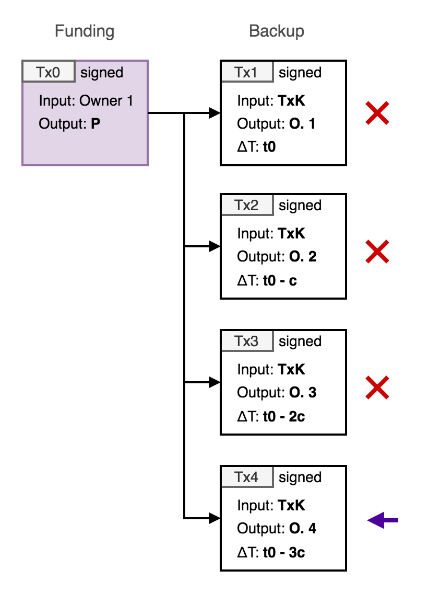
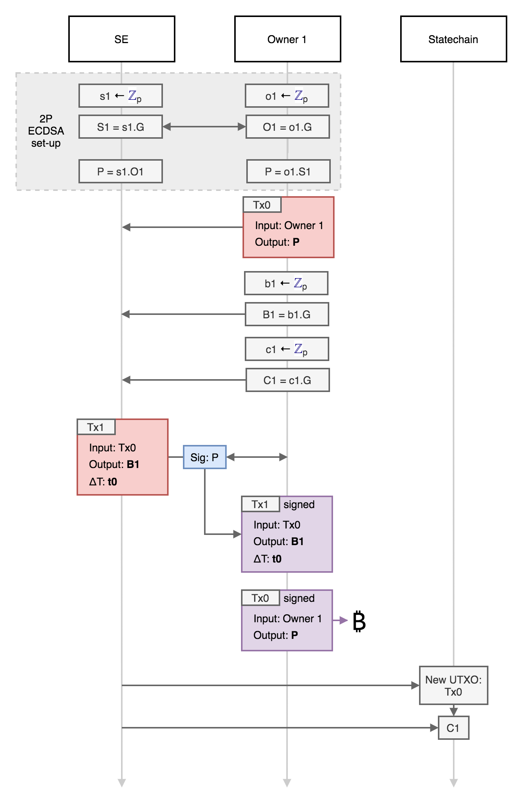
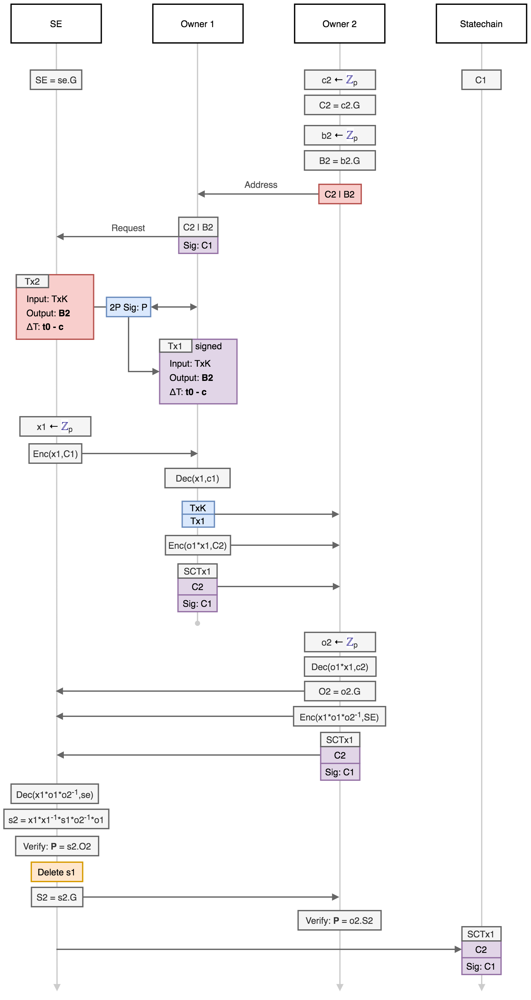

# Statechain protocol for P2PKH and DLCs

This document describes the specification and operation of the Mercury **statechain** [1] system to tranfer ownership of Bitcoin (or Elements based) *unspent transaction outputs* (UTXOs) between parties without performing on-chain transactions. The ability to perform this transfer without requiring the confirmation (mining) of on-chain transactions has several advantages in a variety of different applications:

* Transfer of ownership can be faster (instant) and negligible cost (no on-chain transaction fee). 
* Transfer of ownership can be more private (transfers are only recorded on the statechain). 
* It is possible to transfer the ownership of one public key of a multisig UTXO, for example one position in a discreet log contract (DLC) without the cooperation of the counterparty.  

This functionality requires a trusted third party - refered to as the *statechain entity* or *SE* - which is operated by a service provider, and can generate fee income. Crucially, however, the SE never has custody of the UTXOs, which minimises regulatory requirements and trust. The SE can be formed of a single party, or can be a *federation* of separate entities implemented via multiple key shares, each of which need to agree on the signature generation (see *Federated statchain entities*). 

## UTXO Types

A UTXO is the fundamental object that defines value and ownership in a cryptocurrency such as Bitcoin. A UTXO is identified by a transaction ID (`TxID`) and output index number (`n`) and has two properties: 1. A value (in BTC) and 2. Spending conditions (defined in Script). The spending conditions can be arbitrarily complex (within the limits of the consensus rules), but is most commonly defined by a single public key (or public key hash) and can only be spent by transaction signed with the corresponding public key. This is known as a pay-to-public-key-hash output (P2(W)PKH). Other more complex spending conditions include multisig outputs (where spending transactions need to be signed by `m` public keys where `n >= m` are specified in the spending conditions) and time-locked and hash-locked outputs (inlcuding HTLCs as utilised by the Lightning Network and DLCs). 

The statechain model described here can be used to transfer the ability to sign a single public key spending condition or one part of a 2-of-2 multisig, allowing for the transfer (novation) of DLC counterparty positions. 

## UTXO statechains

The function of the system is that it enables control of a UTXO to be transferred between two parties (who don't trust each other) via the SE without an on-chain transaction. The SE only needs to be trusted to operate the protocol (and crucially not store any information about previous key shares) and then transfer of ownership is completely secure, even if the SE was to later get compromised or hacked. At any time the SE can prove that they have the key share for the current owner (and only to the current owner). Additional trust would be required in the SE that they are not double-spending the output, however they would need to collude with a current owner in order to attempt to do this. But a new owner (i.e. the buyer of the UTXO) requires a guarantee that this hasn't happened (i.e. that the the current owner and SE have conspired to pass ownership to two or more buyers). To guarantee this, the new owner requires a proof that their ownership is *unique*: this is achieved via UTXO *statechains* - immutable and unique sequences of verifiable ownership transfer. The current owner is required to sign a *statechain transaction* (`SCTx`) with an owner key to transfer ownership to a new owner (i.e. a new owner key). This means that any theft of the UTXO by the collusion of a corrupt SE and old owner can be proven. 

The *ownership proof* then consists of a unique sequence of ownership keys (with signed transfers) for the full history of each UTXO. This full history is published by the SE, using the Mainstay protocol to ensure this sequence is both unique and immutable. This utilises Bitcoin's global state (resulting in a verifiable *proof of publication* for each ownership change). 

### Sparse Merkle Tree

A specific SE will operate the proof of publication for all UTXO ownership sequences under its management via a single Mainstay slot. The SE will commit the root of a *sparse Merkle tree* (SMT) into the specified slot every time it is updated (which then in turn is attested to the Bitcoin staychain every block/hour). The SMT has a leaf for each unique UTXO (256 bit number) managed by the SE, and the current UTXO statechain is committed to this leaf at each update. 

UTXO transfers can obviously happen much more frequently than the Mainstay attestation interval (which is limited by the Bitcoin block time), however this statechain attestation substantially limits the value that the SE could steal without owner proof. 

## P2PKH output transfer

The simplest function of a statechain system is to enable the transfer the ownership of individual UTXOs controlled by a single public key from one party to another without an on-chain (Bitcoin) transaction. The SE facilitates this change of ownership, but has no way to seize, confiscate or freeze the output. This is achieved via the SE controling a *share* of the UTXO key combined with a system of *backup* transactions which can be used to claim the value of the UTXO by the current owner in the case the SE does not cooperate. The backup transactions are cooperatively signed by the owners and the SE at the point of transfer, and consist of a *kickoff* transaction (which initiates the timelocks) which can be spent by a second transaction with a relative time-lock (using the `nSequence` field as described in BIP68 [2]) paying to an owner generated address [3]. Each new owner is given the same kick-off transaction and a second signed transaction (paying to the new owner address) with a lower `nSequence` number than the previous owner (allowing them to claim the output of the kickoff transaction before any previous owner). 

  

  <b>Fig. 1</b>: Schematic of confirmed funding transaction, and off-chain signed kick-off transaction and backup transactions for a sequence of 4 owners. 

  

As each previous owner will posses a signed copy of the kickoff transaction, any of these old owners can broadcast it to initiate the backup process, forcing the close of the UTXO and presenting a DoS risk (even though they will not be able to steal the funds). To provide an incentive against this, an anyone-can-spend (OP_TRUE) output can be added to the kickoff transaction (with a dust limit amount) and zero miner fee: this means that for an owner (current or old) to broadcast (and confirm) the kickoff transaction, they must at the same time send a second transaction that spends the anyone-can-spend output and that has sufficient fee to pay for both transactions (via Child Pays For Parent - CPFP). 

  

  <b>Fig. 2</b>: Schematic of the kick-off transaction requiring an additional CPFP spending transaction paying fees. 

  

The decrementing relative timelock backup mechanism limits the number of tranfers that can be made within a reasonable lock-out time. This limitation can be substantially improved using an 'invalidation tree' structure of sequential transactions as described in [3]. 

The life-cycle of a P2PKH deposit into the statechain, transfer and withdrawal is summarised as follows:

1. The depositor (Owner 1) initiates a UTXO statechain with the SE by paying BTC to a P2PKH address where Owner 1 and the SE share the private key required to spend the UTXO. 
2. Owner 1 and the SE cooperatively sign a kick-off transaction spending the UTXO to a relative timelocked transaction in turn spending to an address controlled by Owner 1 which can be confirmed after the `nSequence` locktime in case the SE stops cooperating. 
3. Owner 1 can verifiably transfer ownership of the UTXO to a new party (Owner 2) via a key update procedure that overwrites the private key share of SE that invalidates the Owner 1 private key and *activates* the Owner 2 private key share, after cooperatively signing a new backup transaction paying to an address controlled by Owner 2 which can be confirmed after an `nSequence` locktime, which is shorted (by an accepted confirmation interval) than the previous owner. 
5. This transfer can be repeated multiple times to new owners as required (up until the most recent recovery relative locktime reaches a limit > 0). 
6. At any time the most recent owner and SE can cooperate to sign a transaction spending the UTXO to an address of the most recent owner's choice (withdrawal). 

  

  <b>Fig. 3</b>: Illustration of the deposit into a UTXO, transfer to a sequence of 6 new owners and withdrawal. 

  

As described above, double-spending of the UTXO (by a corrupt SE) is prevented by a proof-of-uniqueness from the Mainstay protocol. Each unique transfer of the UTXO between owners is recorded on the SE statechain, with each transfer requiring a signature from the current owner. Spending of the UTXO by anyone except the current owner can be proven as fraudulent by the current owner. 

### Preliminaries

The SE and each owner are required to generate private keys securely and verify ownership of UTXOs (this can be achieved via a wallet interface, but formally should require connection to a fully verifying Bitcoin node). Elliptic curve points (public keys) are depicted as upper case letter, and private keys as lower case letters. Elliptic curve point multiplication (i.e. generation of public keys from private keys) is denoted using the `.` symbol. The generator point of the elliptic curve standard used (e.g. secp256k1) is denoted as `G`. All arithmetic operations on secret values (in Zp) are modulo the field the EC standard.  

This protocol requires a 2-of-2 MPC ECDSA implementation (which will not be described here - there are several different algorithms with efficiency and security assumption trade-offs: but the initial plan is to utilise either [4] or [5]). The 2-of-2 ECDSA implementation used has two parties (with private keys `a` and `b`) where the shared public key is `P = ab.G` and both parties cooperate to create a signature for `P` without revealing either `a` or `b`. 

In addition, a public key encryption scheme is required for blinded private key information sent between parties. This should be compatible with the EC keys used for signatures, and ECIES will be used. The notation for the use of ECIES operations is as follows: `Enc(m,K)` denotes the encryption of message `m` with public key `K = k.G` and `Dec(m,k)` denotes the decryption of message `m` using private key `k`. 

All transactions are created and signed using segregated witness, which enables input transaction IDs to be determined before signing and prevents their malleability. The SE specifies and publishes a Mainstay slot ID (`slot_id`) for the root of the SMT, which all UTXO statechains can be verified against. 

### Deposit

An owner wants to deposit an amount of BTC into the platform, and they request that the `SE` cooperate with the initialisation and key generation. To prevent DoS attacks on an anonymous service, the `SE` may require that the depositor provide proof of ownership (i.e. signatures) for the funds they wish to deposit before proceeding. The following steps are then completed:

1. The depositor (Owner 1) generates a private key: `o1` (the UTXO private key share). 
2. Owner 1 then calculates the corresponding public key of the share `O1` and sends it to the SE: `O1 = o1.G`
3. The SE then generates a private key: `s1` (the SE private key share), calculates the corresponding public key and sends it to Owner 1: `S1 = s1.G`
4. Both SE and Owner 1 then multiply the public keys they receive by their own private key shares to obtain the same shared public key `P` (which corresponds to a shared private key of `p = o1*s1`): `P = o1.(s1.G) = s1.(o1.G)`

> The above key sharing scheme is the same as that used in the 2P ECDSA protocols [4,5]. The key generation routines of these existing 2P ECDSA implementations can be used in place of the above steps (which can include additional verification and proof steps). 

5. Owner 1 creates a funding transaction (`Tx0`) to pay an amount `A` to the address corresponding to `P` (but doesn't sign it) [this transaction may also have an output for a fee `F` paid to the SE]. This defines the UTXO `TxID` (the outpoint), which is sent to the SE.
6. The SE creates a *kick-off transaction* (`TxK`) which spends `Tx0` and pays `A-D` to `P` and `D` to `OP_TRUE` (where `D` is the dust limit) and has zero miner fee. 
7. Owner 1 and SE cooperatively sign `TxK` via 2P ECDSA. Both parties save this transaction. 
8. Owner 1 genertes `b1` (the backup private key) and computes `B1 = b1.G`. 
9. Owner 1 genertes `c1` (the proof private key) and computes `C1 = c1.G`.
9. Owner 1 creates a *backup transaction* (`Tx1`) that pays the `P` output of `TxK` to `B1`, and sets the `nSequence` to the maximum relative locktime `t0` (according to BIP68). 
10. SE receives `Tx1` and `C1` from Owner 1 and verifies the `nSequence` field. Owner 1 and the SE then sign `Tx1` with shared key (`P`) via 2P ECDSA, which Owner 1 then saves. 
11. Owner 1 then signs and broadcasts their deposit transaction `Tx0`. Once the transaction is confirmed, the deposit is completed. 
12. The SE then adds the public key `C1` to leaf of the SMT at position TxID of `Tx0`. The root of the SMT is then attested to Bitcoin via the Mainstay protocol in slot `slot_id`. 

  

  <b>Fig. 4</b>: Deposit protocol. 

  

This deposit protocol is designed so that no funds are lost if either party becomes uncooperative at any stage. The deposit is only paid to the shared public key once the kick-off and backup transactions are signed. 

### Transfer

Owner 1 wishes to transfer the value of the deposit `A` to a new owner (Owner 2) (as a payment or as part of a complex trade). For this to proceed, the new owner must be aware of the public key that is used to authenticate the SE (`SE`). The new owner may require the current owner prove their unique ownership by signing a message with their key share (`O1`) as published on the statechain. The protocol then proceeds as follows:

1. The receiver (Owner 2) generates a backup private key `b2` and a statechain (proof) private key `c2` (separate keys are used for privacy). They then compute the corresponding public keys `B2 = b2.G` and `C2 = c2.G`. 
2. `B2|C2` then represents the Owner 2 'address' and is communicated to Owner 1 (or published) in order for them to 'send' the ownership. 
3. Owner 1 then requests that the SE facilitate a transfer to Owner 2 (and that the new owner can be authenticated with `C2`). 
4. SE generates a random key `x1` and encrypts it with the Owner 2 statechain public key: `Enc(x1,C1)`
5. `Enc(x1,C1)` is sent to Owner 1 who decrypts it with `c1` to learn `x1`: `Dec(x1,c1)`
6. Owner 1 then computes `o1*x1` and encrypts it with the Owner 2 statechain public key (from the address): `Enc(o1*x1,C2)`
7. Owner 1 creates a new *backup transaction* (`Tx2`) that pays the `P` output of `TxK` to `B2`, and sets the `nSequence` to the relative locktime `t0 - (n-1)*c` (according to BIP68) where `c` is the confirmation interval and `n` is the owner number (i.e. 2). 
8. The SE receives `Tx2` and verifies the `nSequence` field corresponds to `t0 - (n-1)*c`. Owner 1 and the SE then sign `Tx2` with shared key (`P`) via 2P ECDSA, which Owner 1 then saves. 

> The steps 3-8 only require interaction between the SE and owner 1, and can be performed at any time before the involvement of Owner 2 is required. 

9. Owner 1 retrieves the UTXO statechain (ownership sequence) for `Tx0` and signs ownership to `C2` with private key `c1`: this is `SCTx1`
10. Owner 1 then sends Owner 2 a message containing four objects:
	a. `TxK`
	b. `Tx2`
	c. `SCTx1`
	d. `Enc(o1*x1,C2)`

> At this point the Owner 1 has sent all the information required to complete the transfer to Owner 2 and is no longer involved in the protocol. Owner 2 verifies the correctness and validity of the four objects, and the payment is complete. Owner 1 can then complete the key update with the SE at any time. 

The SE key share update then proceeds as follows:

11. Owner 2 generates a new output private key share `o2` and computes `O2 = o2.G`
12. Owner 2 decrypts object d: `Dec(o1*x1,c2)` and then computes `o1*x1*o2_inv` where `o2_inv` is the modular inverse of the private key `o2`. 
13. Owner 2 then encrypts `Enc(o1*x1*o2_inv,SE)`, signs it with `C2` and sends it to the SE along with `SCTx1` and `O2`. 
14. The SE authenticates and decrypts this to learn `o1*x1*o2_inv`: `Dec(o1*x1*o2_inv,se)`
15. The SE then multiplies this product by `x1_inv*s1` (where `x1_inv` the modular inverse of `x1`) to compute `s2 = o1*o2_inv*s1`. 
16. The SE then verifies that `s2.O2 = P` and deletes the key share `s1`. If the SE operations are run in a secure enclave, a remote attestation of this can be sent to Owner 2. 

> `s2` and `o2` are now key the private key shares of `P = s2*o2.G` which remains unchanged (i.e. `s2*o2 = s1*o1`), without anyone having learnt the full private key. Provided the SE deletes `s1`, then there is no way anyone but the current owner (with `o2`) can spend the output. 

17. The SE sends Owner 2 `S2 = s2.G` who verifies that `o2.S2 = P`
18. The SE then adds the public key `C1` to the leaf of the SMT at position TxID of `Tx0`. The root of the SMT is then attested to Bitcoin via the Mainstay protocol in slot `slot_id`. 

  

  <b>Fig. 5</b>: Ownership transfer protocol. 

  

> The SE can keep a database of backup transactions for the users, and broadcast them at the appropriate time in case the users are off-line. Alternatively this can be outsourced to a 'watchtower-like' third party. 

### Orderly Withdrawal

The current owner of a deposit can at any time withdraw from the platform to either gain complete control of the shared key or broadcast a jointly signed transaction. The current owner can request that the SE cooperates in signing a transaction paying the UTXO to certain addresses specified by the owner. The SE may wish to charge a withdrawal fee for providing the service (`F`), which can be included in this transaction.

This would proceed as follows:

1. The current owner (e.g. Owner 2) creates a transaction `TxW` that spends `Tx0` to any address or output(s) they choose. 
2. The owner then requests that the SE cooperate to sign this transaction using the shared public key `P`. 
3. The owner signs the string: `TxID:n:close` with their key `C2` and sends it to the SE. 
4. SE and the owner sign `TxW`
3. The fully signed `TxW` is then broadcast and confirmed. 
4. The SE commits the close string to the leaf of the SMT at position TxID of `Tx0`, to verifiably close the UTXO chain of ownership. 

### Backup withdrawal

In the case that the SE disappears or does not cooperate with the current owner, the current owner can reclaim their funds to an address they control by submitting the kick-off transaction, and then after a timelock delay, their backup transaction. In order to get the kick-off transaction to confirm, they will have to simultaneously submit and CPFP transaction spending the `OP_TRUE` output of `TxK`. 

This would proceed as follows:

1. The current owner creates a fee paying transaction `TxF` has as the `OP_TRUE` output of `TxK` as an input, and other signed inputs sufficient to pay the miner fees for both `TxF` and `TxK`. The output can be to any address chosen by the owner. 
2. The current owner broadcasts both `TxK` and `TxF`, which are then confirmed in the Bitcoin blockchain. 
3. Once `TxK` is confirmed, the current owner broadcasts their backup transaction (e.g. `Tx2`) after the `nSequence` timelock has expired. 

> The owner must ensure they broadcast the backup transaction immediately after the timelock to prevent previous owners from claiming after longer timeouts. 

### Backup attack

Every previous owner of a statechain UTXO has a signed kick-off transaction, and a signed backup transaction with a longer `nSequence` timelock than the current owner. Any one of these previous owners can broadcast the kick-off transaction at any time in an attempt to steal the UTXO funds. So long as the current owner is watching the Bitcoin UTXO set (or has outsourced this to a watchtower), then the currrent owner will always be able to spend the kick-off output with their backup transaction before a previous owner. 

However, this does present a mechanism for a previous owner to harrass the current owner and cause a denial of service. Past owners are incentivised against doing this, as the past owner has to pay twice for the kick-off transaction fees (via CPFP), however there is nothing to prevent it. In the case this does occur (and the SE is still operational), firstly the SE will act as a watchtower and ensure the current owners backup transaction is confirmed. Secondly, the SE will alert the current owner to the broadcast, and will cooperatively sign a transaction to spend the `TxK` `P` output immediately (before any backup transactions become valid) paying either to an address of the owners choosing, or `P` (initiating a new statechain). 

## DLC novation

The ownership of a position in a discreet log contract (DLC) can be transferred using this same basic mechanism, but with the key rotation and backup transactions applied to every output of the multiple Contract Execution Transactions (CETs) of the DLC. The essential protocol is summarised as follows:

Either, or both, of the counterparties in a specific DLC can utilise the SE for novation, and this requires no changes to the DLC protocol. In fact, if one counterparty is using an SE service for novation, the other counterparty does not even need to be aware of this or of any of the changes of ownership. In the following, we decribe the set-up for one counterparty using the service. 

### Initialisation

A user wants to initiate a DLC using the SE service for novation. The following steps are followed as part of the DLC creation process:

1. The first position owner (Owner 1) generates two private keys: `o1` (the UTXO private key share) and `b1` (the backup private key).
2. Owner 1 then calculates the corresponding public key of the share `O1` and sends it to the SE: `O1 = o1.G`
3. The SE then generates a private key: `s1` (the SE private key share), calculates the corresponding public key and sends it to Owner 1: `S1 = s1.G`
4. Both SE and Owner 1 then multiply the public keys they receive by their own private key shares to obtain the same shared public key `P` (which corresponds to a shared private key of `p = o1*s1`): `P = o1.(s1.G) = s1.(o1.G)`
5. Owner 1 and the DLC counterparty create the DLC funding transaction `Tx0` (with supplied inputs) to pay an amount `A` to a 2-of-2 multisig (one public key `P` and the other public key belonging to the counterpary's - `C`. This defines the opening UTXO (the outpoint). 
6. The Owner 1 and the counterparty cooperate to generate the full set of unsigned CETs following the DLC protocol [6]: `TxDLC[i]` where `i = 1,...,n`, after agreeing on an oracle public key `O`. The counterparty partially signs all of them (1-of-2) and sends them to Owner 1. 
7. Owner 1 and the SE then coorperate to partially sign (1-of-2) the full set of CETs with the shared key `P` with 2P ECDSA and sends them to the counterparty. 
8. The SE creates a series of *kick-off transactions* that spend from the outputs that pay to `P` from the full set of CETs (two for each CET):  `TxK[i,1]` and `TxK[i,2]` where `i = 1,...,n`. 
9. Owner 1 and the SE cooperatively sign each `TxK` via 2P ECDSA. Both parties save these transactions. 
10. Owner 1 genertes `b1` (the backup private key) and computes `B1 = b1.G`.
11. Owner 1 creates a series of *backup transactions* for each kick-off transaction that pays the `P` output of each `TxK` to `B1`, and sets the `nSequence` to the maximum relative locktime `t0` (according to BIP68): `Tx1[i,1]` and `Tx1[i,2]` where `i = 1,...,n`. These are sent to the SE. 
10. The SE recieves all `Tx1[i,1]` and `Tx1[i,2]` where `i = 1,...,n` and verifies the `nSequence` field of each one. Owner 1 and the SE then sign each `Tx1` with shared key (`P`) via 2P ECDSA, which Owner 1 then saves. 
10. Owner 1 then co-signs (with the couterparty) and broadcasts the deposit/opening transaction `Tx0`. Once the transaction is confirmed, the deposit is completed. 
11. The SE then adds the UTXO outpoint with `O1` to the *statechain* which is then attested to Bitcoin via the Mainstay protocol. 

### Transfer

Owner 1 wishes to transfer their position in the DLT to a new owner (Owner 2) (as a payment or as part of a complex trade). For this to proceed, the new owner must be aware of the public key that is used to authenticate the SE (`SE`). The new owner may require the current owner prove their unique ownership by signing a message with their key share (`O1`) as published on the statechain. The protocol then proceeds as follows:

Steps 1-14 in the transfer section above are followed to transfer the shared key. Then the following steps are followed:
1. The SE sends Owner 2 the full set of signed kick-off transactions `TxK[i,1]` and `TxK[i,2]` where `i = 1,...,n`. 
2. Owner 2 creates a series of *backup transactions* for each kick-off transaction that pays the `P` output of each `TxK` to `B2`, and sets the `nSequence` to the maximum relative locktime `t0 - c` (according to BIP68): `Tx2[i,1]` and `Tx2[i,2]` where `i = 1,...,n`. These are sent to the SE. 
10. The SE recieves all `Tx2[i,1]` and `Tx2[i,2]` where `i = 1,...,n` and verifies the `nSequence` field of each one. Owner 2 and the SE then sign each `Tx2` with shared key (`P`) via 2P ECDSA, which Owner 2 then saves. 
18. The SE then adds the UTXO outpoint with public key `O2` to the statechain which is then attested to Bitcoin via the Mainstay protocol. 

This can then be repeated to transfer the DLC position to each new owner. 

### DLC closure

Once the oracle publishes the signature at the expiration of the DLC, making one of the CETs valid (`TxCET[j]`) - one of the counterparties submit their valid transaction (OR they can cooperate the sign a separate transaction that pays directly to each party's wallet address - this would also require the cooperation of the SE for the current Owner to sign their part of the opening/deposit transaction). If a CET is broadcast (and confirmed), the SE and the current owner can then cooperate to 'withdraw' the output from the CET (or if the SE is not-responsive, then the current owner can submit the corresponding kick-off backup transaction `TxK[j,1]` and after the timelock `Tx2[j,1]` to claim the CET output). If the SE is unresponsive AND the counterparty broadcasts an invalid state, the kick-off backup transaction `TxK[j,2]` can be broadcast followed by the backup transaction `Tx2[j,2]` after the timelock. 

[1] https://github.com/RubenSomsen/rubensomsen.github.io/blob/master/img/statechains.pdf

[2] https://github.com/bitcoin/bips/blob/master/bip-0068.mediawiki

[3] https://www.ncbi.nlm.nih.gov/pmc/articles/PMC6124062/ 

[4] https://eprint.iacr.org/2017/552.pdf

[5] https://eprint.iacr.org/2019/503.pdf

[6] https://adiabat.github.io/dlc.pdf
