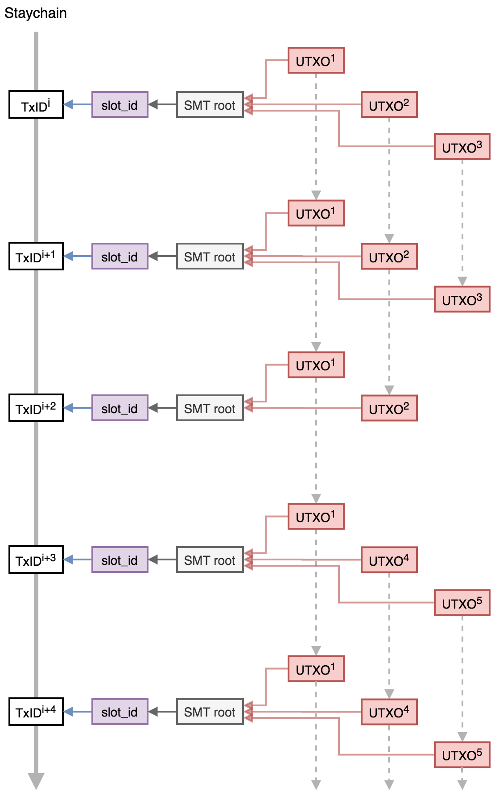
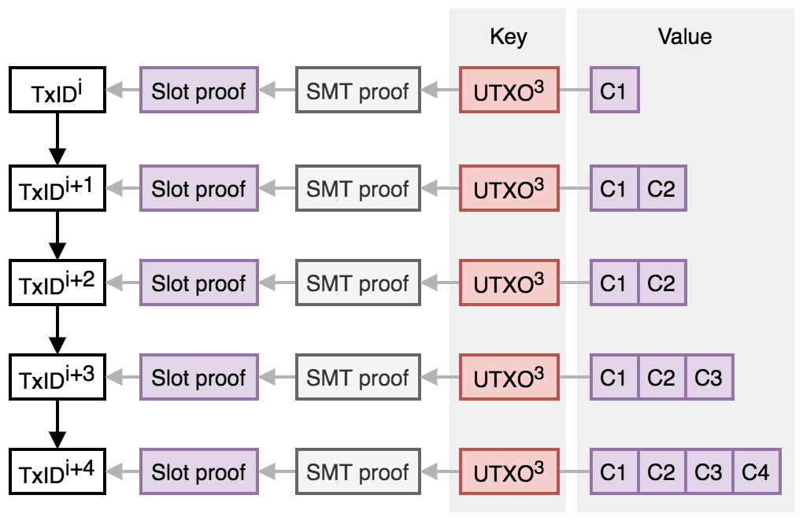

# Mercury statechain protocol specification

This document describes the specification and operation of the Mercury **statechain** [1] system to tranfer ownership of Bitcoin (or Elements based) *unspent transaction outputs* (UTXOs) between parties without performing on-chain transactions. The ability to perform this transfer without requiring the confirmation (mining) of on-chain transactions has several advantages in a variety of different applications:

* Transfer of ownership can be faster (instant) and negligible cost (no on-chain transaction fee). 
* Transfer of ownership can be more private (transfers are only recorded on the statechain). 
* It is possible to transfer the ownership of one public key of a multisig UTXO, for example one position in a discreet log contract (DLC), or one side of a Lightning payment channel, without the cooperation of the counterparty.  

This functionality requires a trusted third party - refered to as the *statechain entity* or *SE* - which is operated by a service provider, and can generate fee income. Crucially, however, the SE never has custody of the UTXOs, which minimises regulatory requirements and the trust required in the SE. The SE can be formed of a single party, or can be a *federation* of separate entities implemented via multiple key shares, each of which need to agree on the signature generation (see *Federated statchain entities*). 

## UTXO Types

A UTXO is the fundamental object that defines value and ownership in a cryptocurrency such as Bitcoin. A UTXO is identified by a transaction ID (`TxID`) and output index number (`n`) and has two properties: 1. A value (in BTC) and 2. Spending conditions (defined in Script). The spending conditions can be arbitrarily complex (within the limits of the consensus rules), but is most commonly defined by a single public key (or public key hash) and can only be spent by transaction signed with the corresponding public key. This is known as a pay-to-public-key-hash output (P2(W)PKH). Other more complex spending conditions include multisig outputs (where spending transactions need to be signed by `m` public keys where `n >= m` are specified in the spending conditions) and time-locked and hash-locked outputs (inlcuding HTLCs as utilised by the Lightning Network and DLCs). 

The statechain model described here can be used to transfer the ability to sign a single public key spending condition between parties, or one part of a 2-of-2 multisig, allowing for the transfer (novation) of DLC counterparty positions or Lightning channels. 

## P2PKH output transfer

The simplest function of the Mercury system is to enable the transfer the ownership of individual UTXOs controlled by a single public key `P` from one party to another without an on-chain (Bitcoin) transaction (or change in the spending condition). The SE facilitates this change of ownership, but has no way to seize, confiscate or freeze the output. To enable this, the private key (`s`) for `P` (where `P = s.G`) is shared between the SE and the owner, such that neither party ever has knowledge of the full private key (which is `s = s1*o1` where `s1` is the SE private key share, and `o1` is the owner key share) and so cooperation of the owner and SE is required to spend the UTXO. However, by sharing the secret key in this way, the SE can change its key share (`s1 -> s2`) so that it combines with a new owner key share (`o2`) with the cooperation of the original owner, but without changing the full key (i.e. `s1*o1 = s2*o2`) all without any party revealing their key shares or learning the full key. The exclusive control of the UTXO then passes to the new owner without an on-chain transaction, and the SE only needs to be trusted to follow the protocol and delete/overwrite the key share corresponding to the previous owner. 

This key update/transfer mechanism is additionally be combined with a system of *backup* transactions which can be used to claim the value of the UTXO by the current owner in the case the SE does not cooperate or has disappeared. The backup transaction is cooperatively signed by the current owner and the SE at the point of transfer, paying to an address controlled by the new owner. To prevent a previous owner (i.e. not the current owner) from broadcasting their backup transaction and stealing the deposit, the `nLocktime` value of the transaction is set to a future specified block height. Each time the ownership of the UTXO is transfered, the `nLocktime` is decremented by a specified value, therefore enabling the current owner to claim the deposit before any of the previous owners. 

  

  <b>Fig. 1</b>: Schematic of confirmed funding transaction, and off-chain signed backup transactions with decrementing nLocktime for a sequence of 4 owners. 

  

The decrementing timelock backup mechanism limits the number of tranfers that can be made within a reasonable lock-out time, and will be specified and enforced by the SE. In order to ensure that the valid backup transaction is broadcast to the Bitcoin network at the correct time, and prevent expired owners from attmepting to steal funds, the SE operates multiple *watch* servers that monitor the block height and send user backup transactions when required. If the SE is shut down then the user is responsible for submitting backup transactions to the Bitcoin network at the correct time, and applications are available to do this automatically. 

The life-cycle of a P2PKH deposit into the statechain, transfer and withdrawal is summarised as follows:

1. The depositor (Owner 1) initiates a UTXO statechain with the SE by paying BTC to a P2PKH address where Owner 1 and the SE share the private key required to spend the UTXO. Additionally, the SE and the depositor can cooperate to sign a backup transaction spending the UTXO to a relative timelocked transaction spending to an address controlled by Owner 1 which can be confirmed after the `nLocktime` block height in case the SE stops cooperating. 
3. Owner 1 can verifiably transfer ownership of the UTXO to a new party (Owner 2) via a key update procedure that overwrites the private key share of SE that invalidates the Owner 1 private key and *activates* the Owner 2 private key share. Additionally, the transfer can incorporate the cooperative signing of a new backup transaction paying to an address controlled by Owner 2 which can be confirmed after an `nLocktime` block height, which is shortened (by an accepted confirmation interval) than the previous owner. 
5. This transfer can be repeated multiple times to new owners as required (up until the most recent recovery `nLocktime` reaches a lower limit determined by the current Bitcoin block height). 
6. At any time the most recent owner and SE can cooperate to sign a transaction spending the UTXO to an address of the most recent owner's choice (i.e. withdrawal). 

  

  <b>Fig. 3</b>: Illustration of the deposit into a UTXO, transfer to a sequence of 6 new owners and withdrawal. 

  

As described below, double-spending of the UTXO (by a corrupt SE) is prevented by a proof-of-uniqueness from the Mainstay protocol. Each unique transfer of the UTXO between owners is recorded on the SE statechain, with each transfer requiring a signature from the current owner. Spending of the UTXO by anyone except the current owner can be unambiguously proven as fraudulent by the current owner. 

## UTXO statechains

The essential function of the Mercury system is that it enables 'ownership' (and control) of a UTXO to be transferred between two parties (who don't need to trust each other) via the SE without an on-chain transaction. The SE only needs to be trusted to operate the protocol (and crucially not store any information about previous key shares) and then the transfer of ownership is completely secure, even if the SE was to later get compromised or hacked. At any time the SE can prove that they have the key share for the current owner (and only to the current owner). Additional trust would be required in the SE that they are not double-spending the output, however they would need to collude with a current owner in order to attempt to do this. However a new owner (i.e. the buyer of the UTXO) requires a guarantee that this hasn't happened (i.e. that the current owner and SE have conspired to pass ownership to two or more buyers). To guarantee this, the new owner requires a proof that their ownership is *unique*: this is achieved via UTXO *statechains* - immutable and unique sequences of verifiable ownership transfer. The current owner is required to sign a *statechain transaction* (`SCTx`) with an owner key to transfer ownership to a new owner (i.e. a new owner key). This means that any theft of the UTXO by the collusion of a corrupt SE and old owner can be independently and conclusively proven. 

The *ownership proof* then consists of a unique sequence of ownership keys (with signed transfers) for the full history of each UTXO. This full history is published by the SE, using the Mainstay protocol to ensure this sequence is both unique and immutable. This utilises Bitcoin's global state (resulting in a verifiable *proof of publication* for each ownership change). 

### Sparse Merkle Tree

A specific SE will operate the proof of publication for all UTXO ownership sequences under its management via a single Mainstay slot (for details refer to the Mainstay [documentation](https://commerceblock.readthedocs.io/en/latest/mainstay-con/index.html)). The SE will commit the root of a [*sparse Merkle tree*](https://eprint.iacr.org/2016/683.pdf) (SMT) into the specified slot every time it is updated (which then in turn is attested to the Bitcoin staychain every block/hour). The SMT has a leaf for each unique UTXO TxID (256 bit number) managed by the SE, and the current UTXO statechain is committed to this leaf at each update. The use of the SMT enables proof that each leaf commitment is unique to the UTXO TxID. 

  

  <b>Fig. 4</b>: Illustration of sequences of UTXO ownership (statechains) committed to the sparse Merkle tree (SMT), the root of which is in turn committed to a defined Mainstay slot (`slot_id`), which is in turn committed to the staychain of transactions on the Bitcoin blockchain. 

  

### Ownership transfer

The UTXO ownership sequence consists of a chain of *statechain transactions* (`SCTx`) transferring ownership. This chain starts with the single *proof* public key of the depositor, and each time the ownership of the UTXO is passed from one owner to the next, the current owner must sign the statechain concatenated with the new owner proof public key. Specifically, when a user deposits into a new UTXO with the SE, they provide a proof public key `C1` (to which only the depositor knows the private key `c1`). This initial state (`s_1 = H(C1)` where `H(...)` denotes the SHA256 hash function) is committed to the SE SMT at the position of the UTXO TxID. 

When the depositor (`C1`) then transfers ownership to `C2` they provide a signature `sig_C1` over `s_1|C2` and the new state:

`s_2 = H(s_1|C2|sig_C1[s_1|C2])`

which is then committed to the SMT at the position of the UTXO TxID. Then when the owner `C2` transfers ownership to `C3` they provide a signature `sig_C2` over `s_2|C3`. The new state then becomes:

`s_3 = H(s_2|C3|sig_C2[s_2|C3])`

and so on for each transfer of ownership from `old_key` to `new_key`:

`new_state = H(old_state|new_key|sig_old_key[old_state|new_key])`

If no change of ownership occurs between Mainstay attestations, the state does not change (and the latest slot attestation is the proof of publication). If the ownership changes more frequently than the slot attestation, then the ownership state is updated for each transfer and the current state is attested at the next interval. 

  

  <b>Fig. 1</b>: Merkle path proofs of UTXO state publication. The committed state for a specified UTXO TxID is updated as the ownership is transferred between public keys. 

  

### Fraud Proof

The statechain (and its proof of publication in the Bitcoin staychain) for a specific UTXO can be used by the current owner as proof of ownership and as a fraud proof if the UTXO is spent without their permission (i.e. by a corrupt or colluding SE keeping old key shares). This acts as a powerful incentive to keep the SE honest and preventing them from commiting a large scale fraud. In order to spend the UTXO, the current owner must sign a `SCTx` transaction with their proof public key (`C`) to the address the Bitcoin UTXO is paid to - if this address is different, this is proof that the SE is corrupt. 

The proof-of-publication (via Mainstay) acts as a proof of unique ownership of the UTXO by the owner, however this has a latency that is limited by the Mainstay attestation period (i.e. the Bitcoin block confirmation time). Proof of ownership cannot be obtained faster than this, however a proof of fraud can be. The state can be committed to an unconfirmed Mainstay transaction instantly (and updated via the replace-by-fee mechanism) which must be signed by the Mainstay operator

## Protocol

### Preliminaries

The SE and each owner are required to generate private keys securely and verify ownership of UTXOs (this can be achieved via a wallet interface, but formally should require connection to a fully verifying Bitcoin node). Elliptic curve points (public keys) are depicted as upper case letter, and private keys as lower case letters. Elliptic curve point multiplication (i.e. generation of public keys from private keys) is denoted using the `.` symbol. The generator point of the elliptic curve standard used (e.g. secp256k1) is denoted as `G`. All arithmetic operations on secret values (in Zp) are modulo the field the EC standard.  

This protocol requires a 2-of-2 MPC ECDSA implementation (which will not be described here - there are several different algorithms with efficiency and security assumption trade-offs: but the initial plan is to utilise either [4] or [5]). The 2-of-2 ECDSA implementation used has two parties (with private keys `a` and `b`) where the shared public key is `P = ab.G` and both parties cooperate to create a signature for `P` without revealing either `a` or `b`. 

In addition, a public key encryption scheme is required for blinded private key information sent between parties. This should be compatible with the EC keys used for signatures, and ECIES will be used. The notation for the use of ECIES operations is as follows: `Enc(m,K)` denotes the encryption of message `m` with public key `K = k.G` and `Dec(m,k)` denotes the decryption of message `m` using private key `k`. 

All transactions are created and signed using segregated witness, which enables input transaction IDs to be determined before signing and prevents their malleability. The SE specifies and publishes a Mainstay slot ID (`slot_id`) for the root of the SMT, which all UTXO statechains can be verified against. 

### Deposit

An owner wants to deposit an amount of BTC into the platform, and they request that the `SE` cooperate with the initialisation and key generation. To prevent DoS attacks on an anonymous service, the `SE` may require that the depositor provide proof of ownership (i.e. signatures) for the funds they wish to deposit before proceeding. The following steps are then completed:

1. The depositor (Owner 1) generates a private key: `o1` (the UTXO private key share). 
2. Owner 1 then calculates the corresponding public key of the share `O1` and sends it to the SE: `O1 = o1.G`
3. The SE then generates a private key: `s1` (the SE private key share), calculates the corresponding public key and sends it to Owner 1: `S1 = s1.G`
4. Both SE and Owner 1 then multiply the public keys they receive by their own private key shares to obtain the same shared public key `P` (which corresponds to a shared private key of `p = o1*s1`): `P = o1.(s1.G) = s1.(o1.G)`

> The above key sharing scheme is the same as that used in the 2P ECDSA protocols [4,5]. The key generation routines of these existing 2P ECDSA implementations can be used in place of the above steps (which include additional verification and proof steps). 

5. Owner 1 genertes `b1` (the backup private key) and computes `B1 = b1.G`. 
6. Owner 1 genertes `c1` (the proof private key) and computes `C1 = c1.G`.
7. Owner 1 creates a funding transaction (`Tx0`) to pay an amount `A` to the address corresponding to `P` (but doesn't sign it) [this transaction may also have an output for a fee `F` paid to the SE]. This defines the UTXO `TxID` (the outpoint), which is sent to the SE.
8. Owner 1 creates a *backup transaction* (`Tx1`) that pays the `P` output of `Tx0` to `B1`, and sets the `nLocktime` to the initial future block height `h0` (where `h0 = cheight + hinit`, `cheight` is the current Bitcoin block height and `hinit` is the specified initial locktime). 
9. SE receives `Tx1` and `C1` from Owner 1 and verifies the `nLocktime` field. Owner 1 and the SE then sign `Tx1` with shared key (`P`) via 2P ECDSA, which Owner 1 then saves. 
10. Owner 1 then signs and broadcasts their deposit transaction `Tx0`. Once the transaction is confirmed, the deposit is completed. 
11. The SE then adds the public key `C1` to leaf of the SMT at position TxID of `Tx0`. The root of the SMT is then attested to Bitcoin via the Mainstay protocol in slot `slot_id`. 

  

  <b>Fig. 4</b>: Deposit protocol. 

  

This deposit protocol is designed so that no funds are lost if either party becomes uncooperative at any stage. The deposit is only paid to the shared public key once the backup transaction is signed. 

### Transfer

Owner 1 wishes to transfer the value of the deposit `A` to a new owner (Owner 2) (as a payment or as part of a complex trade). For this to proceed, the new owner must be aware of the public key that is used to authenticate the SE (`SE`). The new owner may require the current owner prove their unique ownership by signing a message with their key share (`O1`) as published on the statechain. The protocol then proceeds as follows:

1. The receiver (Owner 2) generates a backup private key `b2` and a statechain (proof) private key `c2` (separate keys are used for privacy). They then compute the corresponding public keys `B2 = b2.G` and `C2 = c2.G`. 
2. `B2|C2` then represents the Owner 2 'address' and is communicated to Owner 1 (or published) in order for them to 'send' the ownership. 
3. Owner 1 then requests that the SE facilitate a transfer to Owner 2 (and that the new owner can be authenticated with `C2`). 
4. SE generates a random key `x1` and encrypts it with the Owner 2 statechain public key: `Enc(x1,C1)`
5. `Enc(x1,C1)` is sent to Owner 1 who decrypts it with `c1` to learn `x1`: `Dec(x1,c1)`
6. Owner 1 then computes `o1*x1` and encrypts it with the Owner 2 statechain public key (from the address): `Enc(o1*x1,C2)`
7. Owner 1 creates a new *backup transaction* (`Tx2`) that pays the `P` output of `Tx0` to `B2`, and sets the `nLocktime` to the relative locktime `h0 - (n-1)*c` where `c` is the confirmation interval and `n` is the owner number (i.e. 2). 
8. The SE receives `Tx2` and verifies the `nLoctime` field corresponds to `h0 - (n-1)*c`. Owner 1 and the SE then sign `Tx2` with shared key (`P`) via 2P ECDSA, which Owner 1 then saves. 

> The steps 3-8 only require interaction between the SE and owner 1, and can be performed at any time before the involvement of Owner 2 is required. 

9. Owner 1 retrieves the UTXO statechain (ownership sequence) for `Tx0` and signs ownership to `C2` with private key `c1`: this is `SCTx1`
10. Owner 1 then sends Owner 2 a message containing four objects:
	a. `Tx2`
	b. `SCTx1`
	c. `Enc(o1*x1,C2)`

> At this point the Owner 1 has sent all the information required to complete the transfer to Owner 2 and is no longer involved in the protocol. Owner 2 verifies the correctness and validity of the four objects, and the payment is complete. Owner 1 can then complete the key update with the SE at any time. 

The SE key share update then proceeds as follows:

11. Owner 2 generates a new output private key share `o2` and computes `O2 = o2.G`
12. Owner 2 decrypts object d: `Dec(o1*x1,c2)` and then computes `o1*x1*o2_inv` where `o2_inv` is the modular inverse of the private key `o2`. 
13. Owner 2 then encrypts `Enc(o1*x1*o2_inv,SE)`, signs it with `C2` and sends it to the SE along with `SCTx1` and `O2`. 
14. The SE authenticates and decrypts this to learn `o1*x1*o2_inv`: `Dec(o1*x1*o2_inv,se)`
15. The SE then multiplies this product by `x1_inv*s1` (where `x1_inv` the modular inverse of `x1`) to compute `s2 = o1*o2_inv*s1`. 
16. The SE then verifies that `s2.O2 = P` and deletes the key share `s1`. If the SE operations are run in a secure enclave, a remote attestation of this can be sent to Owner 2. 

> `s2` and `o2` are now key the private key shares of `P = s2*o2.G` which remains unchanged (i.e. `s2*o2 = s1*o1`), without anyone having learnt the full private key. Provided the SE deletes `s1`, then there is no way anyone but the current owner (with `o2`) can spend the output. 

17. The SE sends Owner 2 `S2 = s2.G` who verifies that `o2.S2 = P`
18. The SE then adds the public key `C1` to the leaf of the SMT at position TxID of `Tx0`. The root of the SMT is then attested to Bitcoin via the Mainstay protocol in slot `slot_id`. 

  

  <b>Fig. 5</b>: Ownership transfer protocol. 

  

> The SE keeps a database of backup transactions for the users, and broadcast them at the appropriate time in case the users are off-line. 

### Proposed Improvement to the Transfer protocol

In Lindell's protocol the range proof only works for `x1 < q/3` where q is the field. Therefore 2/3 of the possible `s2` values computed by the SE will be outside of the required range. In the original protocol, steps 12-15 are repeated until the SE signals that a useable `s2` has been found.

An alternative to the the above would be for the SE to apply an additional factor `theta` to the calculation as follows, by substituting the following steps beginning at step `16`:

16. Generate a random number `theta <- Z_q` such that both `s1_theta = s1 * theta` and `s2_theta = s2 * theta` are less than `q/3`
17. The SE then verifies that `s2.theta.O2 = theta.P` and deletes the key share `s1`. If the SE operations are run in a secure enclave, a remote attestation of this can be sent to Owner 2.

> `s2` and `o2` are now key the private key shares of `P = s2*o2.G` which remains unchanged (i.e. `s2*o2 = s1*o1`), without anyone having learnt the full private key. Provided the SE deletes `s1`, then there is no way anyone but the current owner (with `o2`) can spend the output. 

17. The SE sends Owner 2 `S2 = s2.G` and `theta` who verifies that `theta.o2.S2 = theta.P`
18. The SE then adds the public key `C1` to the leaf of the SMT at position TxID of `Tx0`. The root of the SMT is then attested to Bitcoin via the Mainstay protocol in slot `slot_id`. 

### Orderly Withdrawal

The current owner of a deposit can at any time withdraw from the platform to either gain complete control of the shared key or broadcast a jointly signed transaction. The current owner can request that the SE cooperates in signing a transaction paying the UTXO to certain addresses specified by the owner. The SE may wish to charge a withdrawal fee for providing the service (`F`), which can be included in this transaction.

This would proceed as follows:

1. The current owner (e.g. Owner 2) creates a transaction `TxW` that spends `Tx0` to an address `W`. 
2. The owner then requests that the SE cooperate to sign this transaction using the shared public key `P`. 
3. The owner signs the current state concatenated with `H(W)` with their key `C2` and sends it to the SE. 
4. SE and the owner sign `TxW`. The SE must confirm that `TxW` pays to `W` (otherwise this will create a fraud proof). 
3. The fully signed `TxW` is then broadcast and confirmed. 
4. The SE commits the close string to the leaf of the SMT at position TxID of `Tx0`, to verifiably close the UTXO chain of ownership. 

### Backup withdrawal

In the case that the SE disappears or does not cooperate with the current owner, the current owner can reclaim their funds to an address they control by submitting the kick-off transaction, and then after a timelock delay, their backup transaction. In order to get the kick-off transaction to confirm, they will have to simultaneously submit and CPFP transaction spending the `OP_TRUE` output of `TxK`. 

This would proceed as follows:

1. The current owner creates a fee paying transaction `TxF` has as the `OP_TRUE` output of `TxK` as an input, and other signed inputs sufficient to pay the miner fees for both `TxF` and `TxK`. The output can be to any address chosen by the owner. 
2. The current owner broadcasts both `TxK` and `TxF`, which are then confirmed in the Bitcoin blockchain. 
3. Once `TxK` is confirmed, the current owner broadcasts their backup transaction (e.g. `Tx2`) after the `nSequence` timelock has expired. 

> The owner must ensure they broadcast the backup transaction immediately after the timelock to prevent previous owners from claiming after longer timeouts. 

[1] https://github.com/RubenSomsen/rubensomsen.github.io/blob/master/img/statechains.pdf

[2] https://github.com/bitcoin/bips/blob/master/bip-0068.mediawiki

[3] https://www.ncbi.nlm.nih.gov/pmc/articles/PMC6124062/ 

[4] https://eprint.iacr.org/2017/552.pdf

[5] https://eprint.iacr.org/2019/503.pdf

[6] https://adiabat.github.io/dlc.pdf
