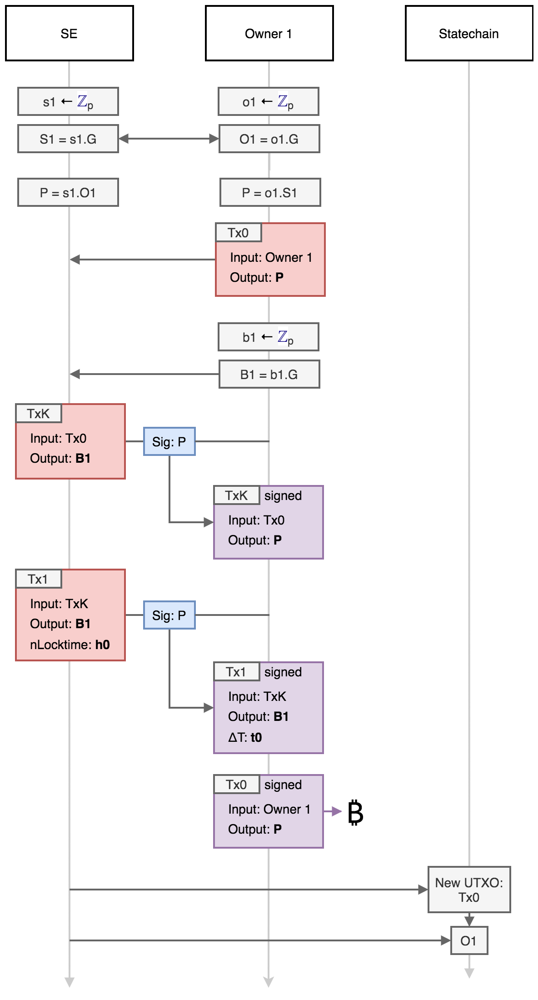
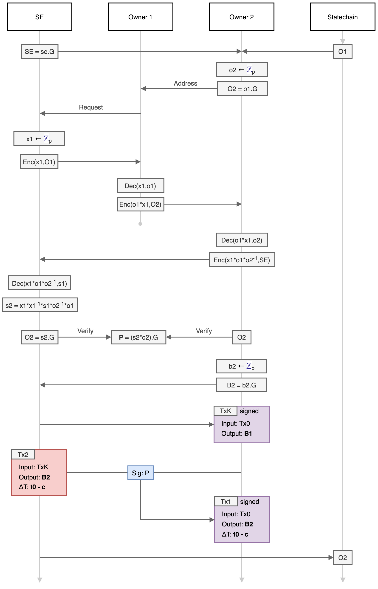

# Statechain protocol for P2PKH and DLCs

This document describes the specification and operation of the Mercury **statechain** [1] system to tranfer ownership of Bitcoin (or Elements based) *unspent transaction outputs* (UTXOs) between parties without performing on-chain transactions. The ability to perform this transfer without requiring the confirmation (mining) of on-chain transactions has several advantages in a variety of different applications:

* Transfer of ownership can be faster (instant) and neglibile cost (no on-chain transaction fee). 
* Transfer of ownership can be more private (transfers are only recorded on the statechain). 
* It is possible to transfer the ownership of one public key of a multisig UTXO, for example one position in a discreet log contract (DLC) without the cooperation of the counterparty.  

This functionality requires a trusted third party - refered to as the *statechain entity* of *SE* - which is operated by a service provider, and can generate fee income. Crucially, however, the SE never has custody of the UTXOs, which minimises regulatory requirements and trust. The SE can be formed of a single party, or can be a *federation* of separate entities impliemented via multiple key shares, each of which need to agree on the signature generation (see *Federated statchain entities*). 

## UTXO Types

A UTXO is the fundamental object that defines value and ownership in a cryptocurrency such as Bitcoin. A UTXO is identified by a transaction ID (`TxID`) and output index number (`n`) and has two properties: 1. A value (in BTC) and 2. Spending conditions (defined in Script). The spending conditions can be arbitrarily complex (within the limits of the consensus rules), but is most commonly defined by a single public key (or public key hash) and can only be spent by transaction signed with the corresponding public key. This is known as a pay-to-public-key-hash output (P2(W)PKH). Other more complex spending conditions include multisig outputs (where spending transactions need to be signed by `m` public keys where `n >= m` are specified in the spending conditions) and time-locked and hash-locked outputs (inlcuding HTLCs as untilised by the Lightning Network and DLCs). 

The statechain model decribed here can be used to transfer the ability to sign a single public key spending condition or one part of a 2-of-2 multisig, allowing for the transfer (novation) of DLC counterparty positions. 

## The statechain

The function of the system is that it enables control of a UTXO to be transferred between two parties (who don't trust each other) via the SE without an on-chain transaction. The SE only needs to be trusted to operate the protocol (and crucially not store any information about previous key shares) and then transfer of ownership is completely secure, even if the SE was to later get compromised or hacked. At any time the SE can prove that they have the key share for the current owner (and only to the current owner). Additional trust would be required in the SE that they are not double-spending the output, however they would need to collude with a current owner in order to attempt to do this. But a new owner (i.e. the buyer of the UTXO) requires a guarantee that this hasn't happened (i.e. that the the current owner and SE have conspired to pass ownership to two or more buyers). To guarantee this, the new owner requires a proof that their ownership is *unique*: this is achieved via the *statechain*. 

The statechain is a data structure that is used to prove that the ownership of each UTXO is unique. This proof is verified by the new owner, and is updated via the SE. The statechain contains the transaction history of each UTXO managed by the SE (which is a requirement to prove uniqueness). The uniquness of the statechain for a specific SE is guaranteed via the Mainstay protocol that utilise Bitcoin's global state (resulting in a verifiable *proof of publication* for each ownership change). 

## P2PKH output transfer

The simplest function of a statechain system is to enable the transfer the ownership of individual UTXOs controlled by a single public key from one party to another without an on-chain (Bitcoin) transaction. The SE facilitates this change of ownership, but has no way to seize, confiscate or freeze the output. This is achieved via the SE controling a *share* of the UTXO key combined with a system of *backup* transactions which can be used to claim the value of the UTXO by the current owner in the case the SE does not cooperate. The backup transactions are cooperatively signed by the owners and the SE at the point of transfer, and consist of a *kickoff* transaction (which initiates the timelocks) which can be spent by a second transaction with a relative time-lock (using the `nSequence` field) paying to an owner generated address [2]. Each new owner is given the same kick-off transaction and a second signed transaction (paying to the new owner address) with a lower `nSequence` number than the previous owner (allowing them to claim the output of the kickoff transaction before any previous owner). 

  

  <b>Fig. 1</b>: Schematic of confirmed funding transaction, and off-chain signed kick-off transaction and backup transactions for a sequence of 4 owners. 

  

As each previous owner will posses a signed copy of the kickoff transaction, any of these old owners can broadcast it to initiate the backup process, forcing the close of the UTXO and presenting a DoS risk (even though they will not be able to steal the funds). To provide an incentive against this, an anyone-can-spend (OP_TRUE) ouput can be added to the kickoff transaction (with a dust limit amount) and zero miner fee: this means that for an owner (current or old) to broadcast (and confirm) the kickoff transaction, they must at the same time send a second transaction that spends the anyone-can-spend output and that has sufficient fee to pay for both transactions (via Child Pays For Parent - CPFP). 

  

  <b>Fig. 1</b>: Schematic of the kick-off transaction requiring an additional CPFP spending transaction paying fees. 

  

The decrementing relative timelock backup mechanism limits the number of tranfers that can be made within a reasonable lock-out time. This limitation can be substantially improved using an 'invalidation tree' structure of sequential transactions as described in [2]. 

The lifecycle of a P2PKH depost into the statechain, transfer and withdrawal is summarised as follows:

1. The depositor (Owner 1) initiates a UTXO statechain with the SE by paying BTC to a P2PKH address where Owner 1 and the SE share the private key reuqired to spend the UTXO. 
2. Owner 1 and the SE cooperatively sign a transaction spending the UTXO to an address controlled by Owner 1 which can be broadcast after a lockout recovery time (nLocktime) in case the SE stops cooperating. 
3. Owner 1 can verifiably transfer ownership of the UTXO to a new party (Owner 2) via a key update procedure that refreshes the private key share of SE that invalidates the Owner 1 private key and *activates* the Owner 2 private key share. 
4. Owner 2 and the SE cooperatively sign a backup *kickoff* transaction spending the UTXO to an address controlled by Owner 2 which can be broadcast after a lockout recovery time (nLocktime) that is 6 blocks sooner than the previous recovery transaction. 
5. This transfer can be repeated multiple times to new owners are requires (up until the most recent recovery locktime is reached). 
6. At any time the most recent owner and SE can cooperate to sign a transaction spending the UTXO to an address of the most recent owner's choice (withdrawal). 

  

  <b>Fig. 1</b>: Illustration of the deposit into a UTXO, transfer to a sequence of 6 new owners and withdrawal. 

  

As described above, double-spending of the UTXO (by a corrupt SE) is prevented by a proof-of-uniqueness from the Mainstay protocol. Each transfer of the UTXO between owners is recorded on the SE statechain. 

### Preliminaries

The SE and each owner are required to generate private keys securely and verify ownership of UTXOs (this can be achieved via a wallet interface). Elliptic curve points (public keys) are depicted as upper case letter, and private keys as lower case letters. Elliptic curve point multiplication (i.e. generation of public keys from private keys) is denoted using the '.' symbol. The generator point of the elliptic curve standard used (e.g. secp256k1) is denoted as `G`.  

This protocol requires a 2-of-2 MPC ECDSA implementaion (which will not be described here - there are several different algorithms with efficiency and security assumption trade-offs). The 2-of-2 ECDSA implementation has two parties (with private keys `a` and `b`) where the shared public key is `P = ab.G` and both parties cooperate to create a signature for `P` without revealing either `a` or `b`. 

### Deposit

An owner wants to deposit an amount of BTC into the platform, and they request that the `SE` cooperate with the initialisation and key generation. The following steps are then completed:

1. The depositor (Owner 1) generates two private keys: `o1` (the UTXO private key share) and `b1` (the backup private key).
2. Owner 1 then calculates the corresponding public key of the share `O1` and sends it to the SE: `O1 = o1.G`
3. The SE then generates a private key: `s1` (the SE private key share), calculates the corresponding public key and sends it to Owner 1: `S1 = s1.G`
4. Both SE and Owner 1 then multiply the public keys they receive by their own private key shares to obtain the same shared public key `P` (which corresponds to a shared private key of `p = o1*s1`): `P = o1.(s1.G) = s1.(o1.G)`
5. Owner 1 creates a funding transaction (`Tx0`) to pay an amount `A` to the address corresponding to `P` (but doesn't sign it) [this transaction may also have an output for a fee paid to the SE]. This defines the UTXO `TxID` and `n` (the outpoint). 
6. Owner 1 creates a *backup transaction* (`Tx1`) that pays the `P` output of `Tx0` to the address of their backup public key (`B1 = b1.G`), with `nLockTime` set to block height `h0` - this is the initial expiry height of the UTXO. 
7. Owner 1 and the SE then sign (via MPC) `Tx1` with shared key (`P`), which Owner 1 then saves. 
8. Owner 1 then signs and broadcasts the deposit transaction `Tx0`. Once the transaction is confirmed, the deposit is completed. 
9. The SE then adds the UTXO outpoint with `O1` to the *statechain* which is then attested to Bitcoin via the Mainstay protocol. 

  

  <b>Fig. 1</b>: Deposit protocol. 

  

This deposit protocol is designed so that no funds are lost if either party becomes uncooperative at any stage. The deposit is only paid to the shared public key once the backup transaction is signed. 

### Transfer

Owner 1 wishes to transfer the value of the deposit `A` to a new owner (Owner 2) (as a payment or as part of a complex trade) and requests to the SE initiate the transfer protocol. The following steps are then completed:

1. Owner 1 sends Owner 2 proof (signature) generated from `O1` which Owner 2 then verifies against the statechain to ensure that the UTXO is uniquely owned by Owner 1 (also the staechain is verified unique against Bitcoin via Mainstay). 
2. Owner 2 generates two private keys: o2 (the new owner UTXO private key share) and b2 (the new owner refund private key).
3. The SE generates a temporary nonce `x` and calculates the value `x*s1` and sends this securely to Owner 2. 
4. Owner 2 then multiplies this received value by the modular inverse of `o2` (`o2_inv`) and then sends this value (`x*s1*o2_inv`), to Owner 1.
5. Owner 1 then multiplies this received value by the key share `o1` and sends the resulting value (`x*s1*o2_inv*o1`) to the SE.
6. The SE then multiplies this received value by the modular inverse of the temporary nonce (`x_inv`) to obtain `x*s1*o2_inv*o1*x_inv`. This cancels the blinding nonce `x` to give `s1*o2_inv*o1`. This value, when multiplied by the new owner key share `o2` equals the original shared private key `s1*o1`. 
7. The SE then sets this value equal to `s2 = s1*o2_inv*o1` and deletes `s1`. `s2` and `o2` are now the key shares of `P` and can be used to colaboritively sign. So long as the SE delets `s1`, the old owner key share (`o1`) is of no use in deriving or co-signing with the full shared private key, and is invalidated. 
8. The shared public key `P` remains unchanged, but the corresponding private key (which no individual party ever has knowledge of or can derive) can only be determined from the key shares of the SE and Owner 2 (i.e. `P = s2*o2.G`).
9. Owner 2 then calculates their backup public key (`B2 = b2.G`) and sends it to the SE.
10. The SE creates a backup transaction (`Tx2`) that pays the output of `Tx0` to the address corresponding to `B2` , with `nLockTime` set to a block height `h0 - c0`, where `c0`, is a confirmation time sufficient to guarantee that `Tx2` can be confirmed in the blockchain before `Tx1` ( therefore making Tx1 invalid).
11. Owner 2 and the SE then cooperate to sign `Tx2` with shared key (`P`) using the MPC ECDSA protocol, which Owner 2 then saves. 
12. The SE then adds the UTXO outpoint with `O1` to the *statechain* which is then attested to Bitcoin via the Mainstay protocol. 

  

  <b>Fig. 1</b>: Ownership transfer protocol. 

  

The principle of the logic of the key transfer is that the two separate key shares are updated, but the full shared private key (which no-one knows) remains the same. The new owner chooses a new secret value for their private key share, and this (along with the private key share of the previous owner) is utilised by the SE to update their share. The use of the nonce (`x`) prevents any of the participants from determining any information about each others secret keys. In this way Owner 2 cannot determine `o1` from  `x*o1`, and the SE cannot determine `o1` or `o2` from `x*o2_inv*o1`. 

This transfer protocol can be repeated to transfer the ownership to new owners. Each time the SE key share `sX` is updated, the previous key shares become invalid and are of no use even if the current key share is subsequently revealed. The speed of the transfer is limited only by the communication channel latency and the execution time of the computations. Near instantaneous transfers are dependent on all the participants being on-line simultaneously and being responsive.

At each change of ownership, a new backup transaction is created and signed with an `nLocktime` block height sooner than the previously issued backup transaction. This backup must then be broadcast to the network immediately after the locktime expires, to invalidate the previous backups in the case that the SE does not or cannot cooperate. Therefore, for the first owner, the nLocktime (block height) is set to `h0`, and for the owner `n`, the nLocktime is set to `h0 — n*c` (where `c` is the confirmation blocks). The utilisation of this decrementing lock-time scheme for the backup transaction puts a finite limit on the number of transfers that can occur before the UTXO must be sent to a new public key, as the most recent lock time gets closer to the current time. However, unlike in the Lightning Network, each owner knows in advance when the UTXO is set to expire, so there is no requirement to constantly monitor the full Bitcoin UTXO set or employ watchtowers. 

> The SE can keep a database of backup transactions for the users, and broadcast them at the appropriate time in case the users are off-line. Alternatively this can be outsourced to a 'watchtower-like' third party. 

> For each new UTXO owner, several different backup transactions with the same `nLocktime` but different transaction fees can be generated. The user can then choose which transaction fee to broadcast depending on network congestion at the time of claiming the backup. 

### Withdrawal

The current owner of a deposit can at any time withdraw from the platform to either gain complete control of the shared key or broadcast a jointly signed transaction. The current owner can request that the SE cooperates in signing a transaction paying the UTXO to certain addresses specified by the owner. The SE may wish to charge a withdrawal fee for providing the service, which can be included in this transaction.

## DLC novation

The ownership of a position in a discreet log contract (DLC) can be transferred using this same basic mechanism, but with the key rotation and refund transactions applied to every output of the multiple Contract Execution Transactions (CETs). The essential protocol is summarised as follows:

Either, or both, of the counterparties in a specific DLC can utilise the SE for novation, and this requires no changes to the DLC protocol. In fact, if one counterparty is using an SE service for novation, the other counterparty does not even need to be aware of this or of any of the changes of ownership. In the following, we decribe the set-up for one counterparty using the service. 

### Initialisation

An user wants to initiate a DLC using the SE service for novation. The following steps are followed as part of the DLC creation process:

1. The first position owner (Owner 1) generates two private keys: `o1` (the UTXO private key share) and `b1` (the backup private key).
2. Owner 1 then calculates the corresponding public key of the share `O1` and sends it to the SE: `O1 = o1.G`
3. The SE then generates a private key: `s1` (the SE private key share), calculates the corresponding public key and sends it to Owner 1: `S1 = s1.G`
4. Both SE and Owner 1 then multiply the public keys they receive by their own private key shares to obtain the same shared public key `P` (which corresponds to a shared private key of `p = o1*s1`): `P = o1.(s1.G) = s1.(o1.G)`
5. Owner 1 and the DLC counterparty create the DLC funding transaction (with supplied inputs) to pay an amount `A` to a 2-of-2 multisig (one public key `P` and the other public key the counterpary's - `C`. [this transaction may also have an output for a fee paid to the SE]. This defines the opening UTXO `TxID` and `n` (the outpoint). 
6. The Owner 1 and the counterparty cooperate generate the full set of CETs following the DLC protocol, after agreeing on an oracle public key `O`. The counterparty partially signs all of theirs and sends them to Owner 1. 
7. Owner 1 and the SE then coorperate to partially sign the full set of CETs with the shared key `P` and sends them to the counterparty. 
8. Owner 1 creates a *backup transaction* (`Tx1(n)`) for each of the CETs that pays the `P + oracle_sig` output of each CET to the address of their backup public key (`B1 = b1.G`), with `nLockTime` set to block height `h0` - this is the initial expiry height of the UTXO. 
9. Owner 1 and the SE then sign (via MPC) `Tx1(n)` for each of the CETs with shared key (`P`), which Owner 1 then saves. 
10. Owner 1 then co-signs (with the couterparty) and broadcasts the deposit/opening transaction `Tx0`. Once the transaction is confirmed, the deposit is completed. 
11. The SE then adds the UTXO outpoint with `O1` to the *statechain* which is then attested to Bitcoin via the Mainstay protocol. 

### Transfer

Owner 1 wishes to transfer the ownership of their position in the DLC to a new owner (Owner 2) and requests to the SE initiate the transfer protocol. The following steps are then completed:

1. Owner 1 sends Owner 2 proof (signature) generated from `O1` which Owner 2 then verifies against the statechain to ensure that the UTXO containing the DLC funding is uniquely owned by Owner 1 (also the staechain is verified unique against Bitcoin via Mainstay). They also send the full set of CETs and the oracle details (Owner 2 should verify the oracle keys). 
2. Owner 2 generates two private keys: `o2` (the new owner UTXO private key share) and b2 (the new owner refund private key).
3. The SE generates a temporary nonce `x` and calculates the value `x*s1` and sends this securely to Owner 2. 
4. Owner 2 then multiplies this received value by the modular inverse of `o2` (`o2_inv`) and then sends this value (`x*s1*o2_inv`), to Owner 1.
5. Owner 1 then multiplies this received value by the key share `o1` and sends the resulting value (`x*s1*o2_inv*o1`) to the SE.
6. The SE then multiplies this received value by the modular inverse of the temporary nonce (`x_inv`) to obtain `x*s1*o2_inv*o1*x_inv`. This cancels the blinding nonce `x` to give `s1*o2_inv*o1`. This value, when multiplied by the new owner key share `o2` equals the original shared private key `s1*o1`. 
7. The SE then sets this value equal to `s2 = s1*o2_inv*o1` and deletes `s1`. `s2` and `o2` are now the key shares of `P` and can be used to colaboritively sign. So long as the SE delets `s1`, the old owner key share (`o1`) is of no use in deriving or co-signing with the full shared private key, and is invalidated. 
8. The shared public key `P` remains unchanged, but the corresponding private key (which no individual party ever has knowledge of or can derive) can only be determined from the key shares of the SE and Owner 2 (i.e. `P = s2*o2.G`).
9. Owner 2 then calculates their backup public key (`B2 = b2.G`) and sends it to the SE.
10. The SE creates a *backup transaction* (`Tx1(n)`) for each of the CETs that pays the `P + oracle_sig` output of each CET to the address of their backup public key (`B2 = b2.G`), with `nLockTime` set to block height `h0 - c0`, where `c0`, is a confirmation time sufficient to guarantee that any `Tx2(n)` can be confirmed in the blockchain before any `Tx1(n)` (therefore making `Tx1(n)` invalid).
11. Owner 2 and the SE then cooperate to sign each `Tx2(n)` with shared key (`P`) using the MPC ECDSA protocol, which Owner 2 then saves. 
12. The SE then adds the UTXO outpoint with `O1` to the *statechain* which is then attested to Bitcoin via the Mainstay protocol. 

This can then be repeated to transfer the DLC position to each new owner. 

### DLC closure

Once the oracle publishes the signature at the expiration of the DLC, making one of the CETs valid (`i`) - one of the counterparties submit their valid transaction (OR they can cooperate the sign a separate transaction that pays directly to each party's wallet address - this would also require the cooperation of the SE for the current Owner to sign their part of the opening/deposit transaction). If a CET is broadcast (and confirmed), the SE and the current owner can then cooperate to 'withdraw' the output from the CET (or if the SE is not-responsive, then the current owner can the correspodning backup transaction `Tx(i)` to claim the CET output). 

[1] https://github.com/RubenSomsen/rubensomsen.github.io/blob/master/img/statechains.pdf
[2] https://www.ncbi.nlm.nih.gov/pmc/articles/PMC6124062/
